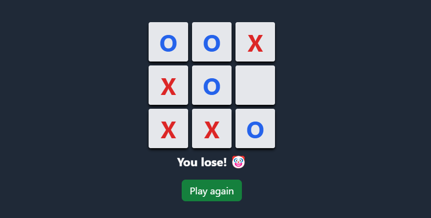
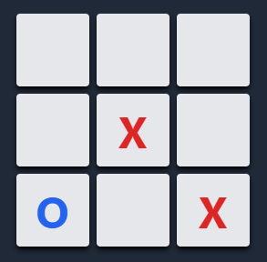
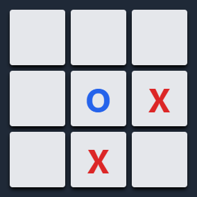
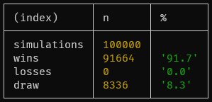

This is my first attempt at building any sort of artificial intelligence and I deliberately didn't look too much into the theory behind it. It works by simulating sequences of moves based on heuristics, and then choosing the best move based on the outcome and the number of moves of those sequences. I am not entirely sure that it plays perfectly but I am pretty confident that it's unbeatable. (By unbeatable I mean that it will never lose. It will still draw if the opponent plays perfectly).

At first I didn't include the heuristic evaluation, so it would simulate every possible sequence of moves. Not only was this slow, but it treated every sequence as equally probable, which is not the case. For example, consider this board state:

X (the player) can obviously win by playing in the top left square unless O (the AI) blocks it. Therefore simulating all non-winning moves is not only a waste of time and processing power but skews the outcome evaluation since there are way more possible (yet unlikely) sequences where X does not play in the top left if they're able to. This led me to implement the heuristic evaluation, which is a simple function that assigns a score to a given board state.

At this point it was faster and smarter, but not perfect. It would still lose occasionally in my simulations. (Competing against another "AI" that played completely randomly). Analyzing them, I realized that it would lose when the opponent made, let's say, questionable moves in the first two-or-so turns. In other words, moves which yielded lower heuristic scores. For example, consider this board state:

At first glance, it might seem like X isn't posing an immediate threat. But there are in fact only three possible moves that O can make to ensure that it won't lose: top right, bottom right, or bottom left. Otherwise if X plays bottom right they will have two potential three-in-a-rows and O can't block them both in one move. To fix this, I lowered the threshold for the heuristic evaluation when selecting potential moves by the opponent. This is now the result of 100,000 simulations which I'm pretty happy with:

[Try it out here](https://tic-tac-astro.vercel.app/)

[Source code here](https://github.com/fransek/tic-tac-astro)
